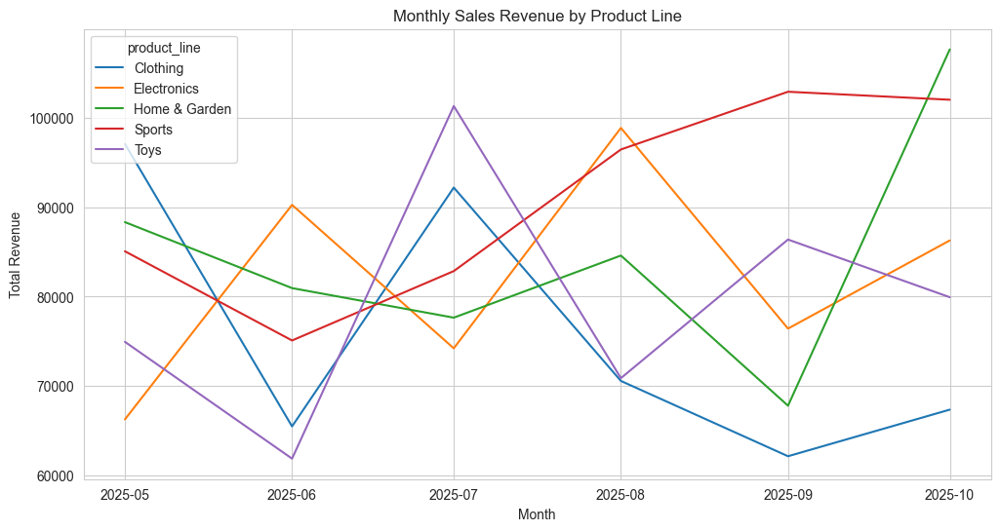

# Magic Plot

`magic_plot` is a Python library that generates visualizations from natural language descriptions using AI. Simply describe what you want to plot in plain English, and `magic_plot` will automatically query your DuckDB database and create the visualization.

## Example

```python
import duckdb
from magic_plot import magic_plot
con = duckdb.connect("file.db")
magic_plot(con, "Plot monthly sales revenue by product line")
```




## Why Magic Plot?

Traditional data visualization requires writing SQL queries and matplotlib/seaborn code. With `magic_plot`, you skip both steps:

- **No SQL required**: Describe what data you want in natural language
- **No plotting code**: The visualization is generated automatically
- **Fast iteration**: Try different plots by changing the description
- **Powered by local AI**: Uses Ollama with the free, private qwen3:8b model.

## How It Works

1. Your natural language prompt is sent to an LLM to generate SQL
2. The SQL query extracts relevant data from your DuckDB database
3. The data structure is analyzed and sent to the LLM again
4. Seaborn plotting code is generated and executed
5. The plot is displayed

## Installation

```bash
pip install magic-plot
```

You'll also need [Ollama](https://ollama.ai/) installed with the qwen3:8b model:

```bash
ollama pull qwen3:8b
```
